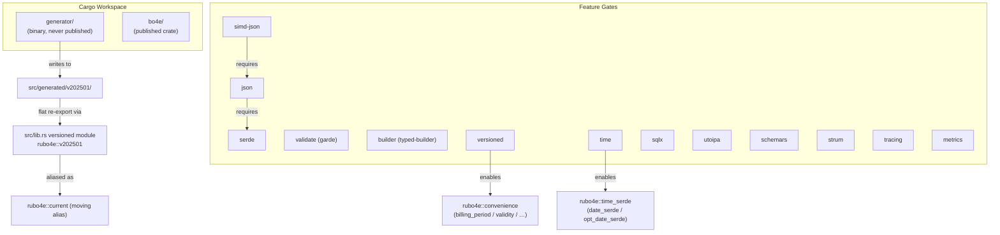

# Architecture

This page describes the workspace layout, module structure, feature gate taxonomy,
and the design boundary between this library and application code.

---

## Workspace Layout

```
rubo4e/
├── Cargo.toml               — workspace root ([workspace] + [package name = "rubo4e"])
├── deny.toml                — cargo-deny policy (licences, advisories)
├── justfile                 — build / generate / test recipes
├── docs/                    — technical documentation (this directory)
├── src/                     — bo4e crate source
│   ├── lib.rs               — crate root; feature-gated re-exports, prelude, Bo4eObject trait
│   ├── error.rs             — IdentifierError and LengthExpectation types
│   ├── json/                — Bo4eJsonExt, Bo4eExtensionData, LimitedExtensionMap
│   ├── schema_helpers.rs    — schemars schema_with= helpers for OffsetDateTime and Date
│   ├── time_serde.rs        — date_serde / opt_date_serde modules (time feature)
│   ├── convenience.rs       — hand-written ergonomic methods on generated types
│   ├── identifiers/         — MaloId, MeloId, EicCode, ObisCode, …
│   ├── validation/          — garde-based cross-field validators
│   └── generated/           — written by generator; never pub outside crate
│       ├── mod.rs           — re-exports v202501
│       └── v202501/         — flat .rs files, one per BO/COM/enum type
│           ├── mod.rs       — re-exports all types + BoTyp / ComTyp discriminants
│           ├── marktlokation.rs
│           ├── vertrag.rs
│           └── …
│
├── generator/               — internal code generator; never published
│   ├── Cargo.toml
│   ├── src/
│   │   ├── main.rs
│   │   ├── parser.rs        — JSON Schema → AST
│   │   ├── inference.rs     — semantic type inference (suffix-based heuristics)
│   │   └── emitter.rs       — AST → Rust source
│   ├── schemas/
│   │   └── v202501.0.0/     — pinned schema snapshot
│   └── tests/
│       ├── round_trip.rs    — generator snapshot tests
│       └── snapshots/       — expected generator output
│
├── fuzz/                    — cargo-fuzz targets
│   └── fuzz_targets/
│       └── fuzz_deserialize_vertrag.rs
│
├── examples/                — runnable usage examples
│   ├── builder.rs
│   └── serialize.rs
│
└── tests/
    ├── golden/              — official JSON payloads for round-trip tests (flat, no version subdir)
    ├── compat/              — cross-implementation compatibility vectors
    │   ├── python/
    │   └── go/
    └── snapshots/           — insta snapshots (schemars JSON Schema output)
```

---

## Module Relationship Diagram



---

## Feature Gate Reference

| Feature | Default | External dep added | MSRV impact | Description |
|---------|---------|-------------------|-------------|-------------|
| `serde` | ✓ | `serde` | none | Derive `Serialize`/`Deserialize` on all types |
| `json` | — | `serde_json` | none | `to_json_*()` methods; `serde` implied |
| `simd-json` | — | `simd-json` | none | SIMD-accelerated JSON (x86_64 AVX2 / ARM NEON) |
| `time` | — | `time` | none | `OffsetDateTime` for datetime fields; `Date` for date-only fields; enables `rubo4e::time_serde` |
| `decimal` | — | `rust_decimal` | none | `Decimal` for all monetary/quantity fields |
| `builder` | — | `typed-builder` | none | Typed builder derives on all BO/COM structs |
| `validate` | — | `garde` | **1.87** | `.validate()` method on all structs |
| `schemars` | — | `schemars` | none | `JsonSchema` derive on all types; enables `rubo4e::schema_helpers` |
| `versioned` | — | none | none | Conditional compilation of `v202501` and `current` modules; enables `rubo4e::convenience` |
| `sqlx` | — | `sqlx` | none | `sqlx::Type`/`Encode`/`Decode` for identifiers and enums |
| `utoipa` | — | `utoipa` | none | `ToSchema` derive on all types |
| `strum` | — | `strum` | none | `Display`/`FromStr` on all enums |
| `tracing` | — | `tracing` | none | Structured diagnostics (identifier failures, extension-data events) |
| `metrics` | — | `metrics` | none | Counter export hooks (metrics ecosystem) |

> **MSRV:** The library targets Rust ≥ **1.87** (set in `Cargo.toml` via `rust-version`). The `validate` feature (via `garde` v0.23) requires 1.87 and is the binding constraint. Enabling `validate` with an older toolchain produces a clear compiler error.

---

## Design Boundary

This library provides **types** and **domain logic**. It does not provide:

- HTTP handler code (no Axum extractors, no Actix-web guards)
- Database migration scripts
- gRPC service definitions
- Anything that requires knowledge of a specific application framework

Consumers compose `rubo4e` types with their own HTTP, persistence, or messaging layer.

---

## Code Generation Policy

The generator (`generator/`) is the only component that writes to `src/generated/`.
Generated code is **committed to the repository** so that:

1. `cargo build` works without running the generator
2. CI can verify that committed code matches the pinned schema (diff check)
3. Code review can inspect schema-driven changes

The `generated/` subtree is never `pub` beyond the crate boundary. All public types
are flat-re-exported through `src/generated/v<version>/mod.rs`, which is then
re-exported from the version-gated module in `src/lib.rs` (e.g., `pub mod v202501`).
There are no hand-curated `bo/`, `com/`, or `enums/` wrapper modules — all types
live in the flat generated directory.

---

## MSRV Policy

- New code targeting Rust **1.85** or later is acceptable.
- The `validate` feature requires **1.87** (garde's minimum). Document this prominently.
- CI tests on the MSRV toolchain to prevent accidental regression.
- `rust-version = "1.87"` is set in the root `Cargo.toml` (garde is a hard dep when `validate`
  is active; setting MSRV conservatively avoids confusing errors).
